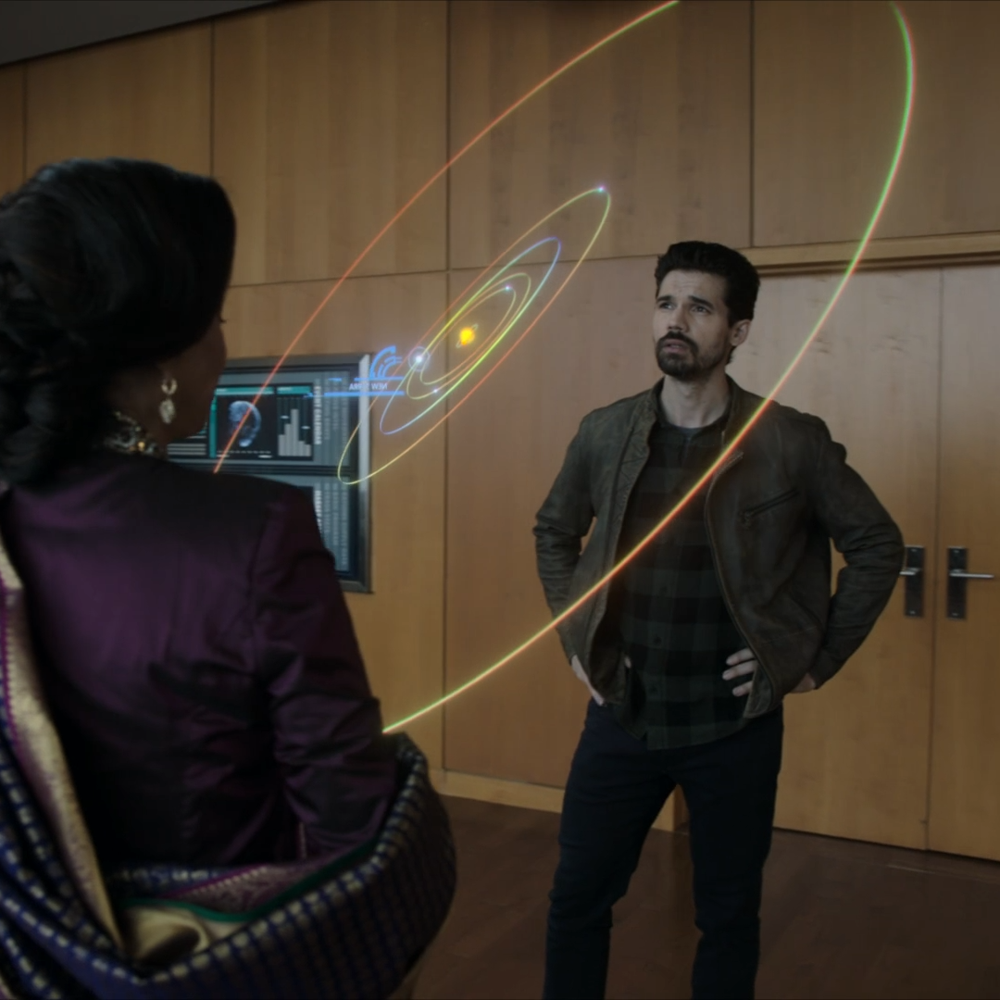

- providing a stable simulated reference frame as suggested in [[1](#source-1)]
- rephrasing interaction context from user moving through simulation to user (stationary) manipulating the simulation 
  around him
  - reducing perceived motion and sensory conflict

- creating a grid below the user's feet, offering a floor as a stable reference frame in the simulated environment
- adjustable settings:
  - size/coarseness of the grid
  - offset (to adjust to user size/real floor)
  - Falloff distance (how far the grid is shown until it fades)
  - alpha & color (to adjust transparency and color of the grid)

###### source 1
*Clifton J, Palmisano S*  
[
Effects of steering locomotion and teleporting on cybersickness and presence in HMD-based virtual reality
](https://doi.org/10.1007/s10055-019-00407-8)
