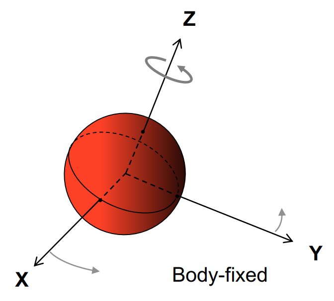
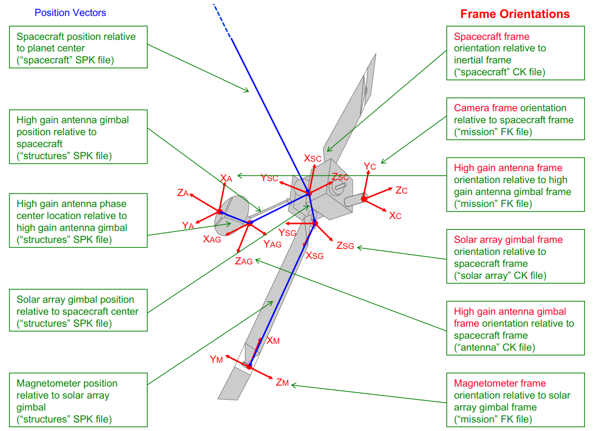
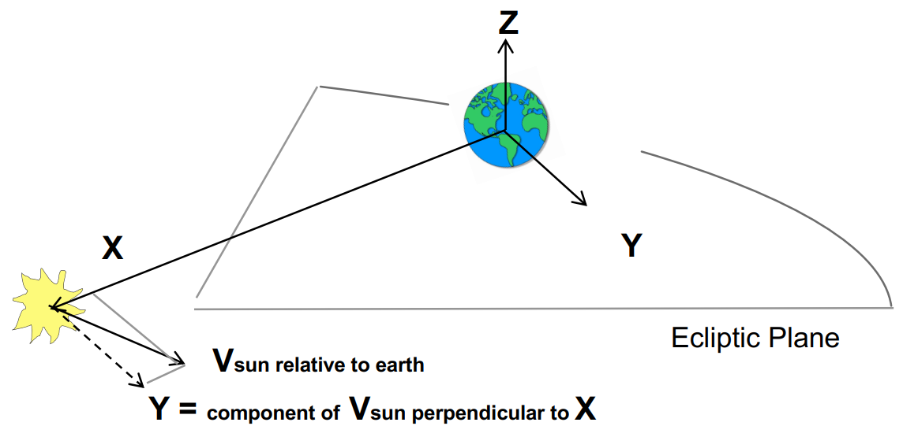
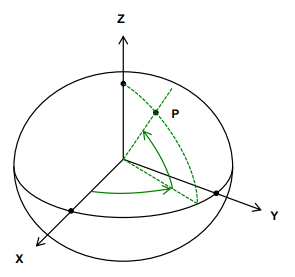
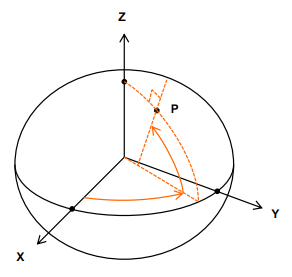
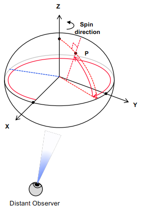
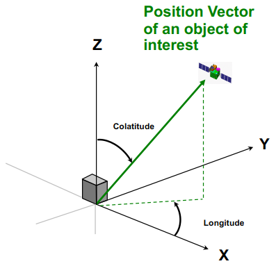
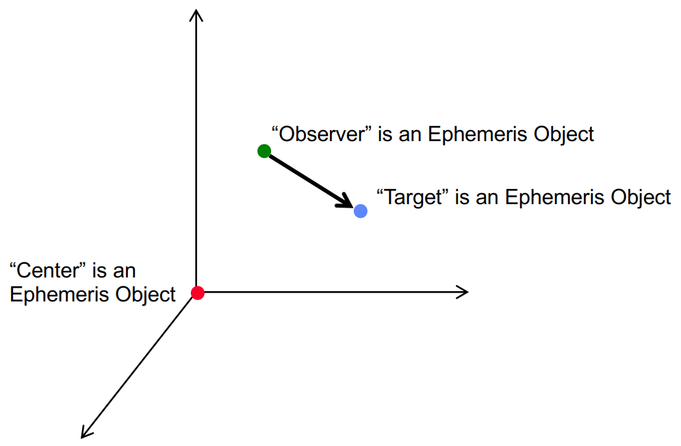
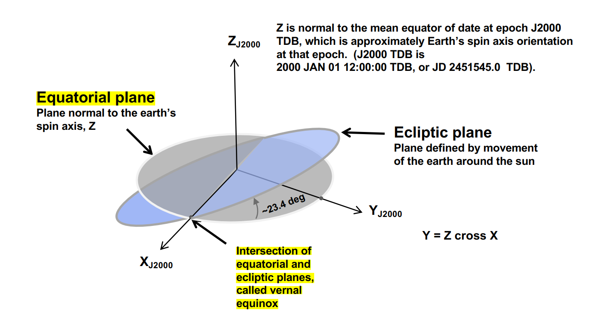

# NAIF Reference Frames and Coordinate Systems in SPICE Context

## Reference Frames
> Specified by an ordered set of three mutually orthogonal, possibly time dependent, unit-length direction vectors
> [[1]](#1)
- reference frame's center must be SPICE ephemeris object whose location is the origin (0, 0, 0) of the frame [[1]](#1)
- Frame Classes:
    - Inertial Frames:
        - center must always be solar system barycenter
        - Non-rotating with respect to stars
        - Non-accelerating origin (typically non-zero velocity, but negligible acceleration)
        - **[J2000](#j2000) / EME 2000** (actually **[ICRF](#icrf)**)
    - Non-Inertial Frames:
        - Accelerating, including by rotation
        - Body-Fixed Frames (PCK/SPK):
            - center of frame is the center of a natural body (sun, planet, satellite, comet, asteroid)
            - center location specified by SPK or PCK file [[2]](#2)
            - tied to a named body and rotating with the body
            
            [[1]](#1)
            - most specifications for most common named bodies are hard-coded into SPICE ("IAU_bodyname", i.e. IAU_MARS)
            - rotation state (orientation at specific time) determined using SPICE text PCK containing data published
              by IAU
            - **IAU_EARTH and IAU_MOON exist but should NOT be used** (See SPICE tutorial “lunar-earth_pckfk” for
              best frames)
        - [Topocentric](#topocentric-coordinate-system) Frames (associated with an object on or near the surface of a natural body)
            - one axis always normal to reference spheriod (parallel to gravity gradient)
        - Spacecraft (main structure "bus")
        - Instrument
            - usually instruments have one or more frames associated (also applicable to spaceraft antenna, solar
             array etc.)
        
        [[1]](#1)
        - Dynamic
            - special family of SPICE unique frames
            - time-dependent orientation (does not include frames where orientation is provided using a CK/PCK)
            - different families: Two-vector, Euler, and Of-date
            - *example:* Geocentric Solar Ecliptic (GSE)
            
            [[1]](#1)

## Coordinate Systems
- Planeto**centric** Coordinates
    - for planets and their satellites +Z axis points to north side of invariable plane (plane whose normal is the
      angular momentum vector **of the solar system**) [[1]](#1)
        - longitude increases positively eastward (-180 to +180)
        - latitude increases positively northward (-90 to +90)
    - for dwarf planets, asteroids and comets +Z axis points to positive pole
        - positive pole (north pole in SPICE) is along spin axis, so that the object spins right-hand wise

[[1]](#1)

- Planeto**detic** Coordinates
    - axes same as planetocentric coordinate system
    - longitude same as planetocentric
    - latitude tied to reference ellipsoid
        - for a point on a reference ellipsoid, angle is measured from X-Y-plane to surface normal at the point
        - for a point not on the reference ellipsoid, the nearest point on it is used.

[[1]](#1)

- Planeto**graphic** Coordinates
    - axes same as planetocentric coordinate system
    - longitude defined so that the longitude seen by a distant, fixed observer increases with time (0 to 360)
    - exceptions: earth, moon, and sun, where longitude increases positively eastwards (0 to 360)
    - latitude same as planeto**detic** latitude
    - **no consistent standard for dwarf planets, asteroids, and comets**

[[1]](#1)

- Spherical Coordinates
    - axes same as above
    - longitude defined as angle between +X-axis and X-Y-plane projection of position vector, counter-clockwise
      direction (right-hand wise)
    - colatitude defined as angle between +Z-axis and position vector (aka. zenith angle, inclination angle, polar
      angle)

[[1]](#1)

- Azimuth-Elevation Coordinates
    - azimuth defined as angle between +X-axis and X-Y-plane projection of position vector, clockwise direction
      (left-hand wise)
    - elevation defined as angle between X-Y-plane and position vector

## State and Orientation Data
> State data contains position and velocity.
- Reference frame center relevant in specification of states. [[1]](#1)
    - origin cancels out when doing vector substraction, but is used in computing light time to centers of non-inertial
      frames. [[1]](#1)
> Orientation data contains pointing vector.
> [[1]](#1)

### Specifying Positions
- positions marked by ephemeris objects (positions in J2000 frame)

[[1]](#1)

## Glossary

#### Topocentric Coordinate System
Celestial coordinate system that uses the observer's local horizon as the fundamental plane. Coordinates of an object
 are expressed in altitude angle and azimuth. [[4]](#4)

[[4]](#4)

#### J2000
Frame based on earth's equator and equinox (determined from observations of planetary motions and other data). [[1]](#1)

[[1]](#1)

J2000 is almost coincident with [ICRF](#icrf) (rotation of less than 0.1 arc second difference).
SIPCE considers them the same as all data is referenced to ICRF, but for compatibility only "J2000" is recognized as
 a name.

#### ICRF
**International Celestial Reference Frame (ICRF)** creates a quasi-inertial frame of reference centered at the
 barycenter of the solar system, whose axes are defined by the measured positions of extragalactic sources (mainly
 quasars). [[3]](#3)

[[1]](#1)

---
### Sources
######1
[NAIF SPICE Tutorial](https://naif.jpl.nasa.gov/pub/naif/toolkit_docs/Tutorials/pdf/individual_docs/17_frames_and_coordinate_systems.pdf)
######2
[SPICE Appendix: Reference Frames](https://naif.jpl.nasa.gov/pub/naif/toolkit_docs/C/req/frames.html)
######3
[Wikipedia: International Celestial Reference Frame](https://en.wikipedia.org/wiki/International_Celestial_Reference_Frame)
######4
[Wikipedia: Horizontal Coordinate System](https://en.wikipedia.org/wiki/Horizontal_coordinate_system)
