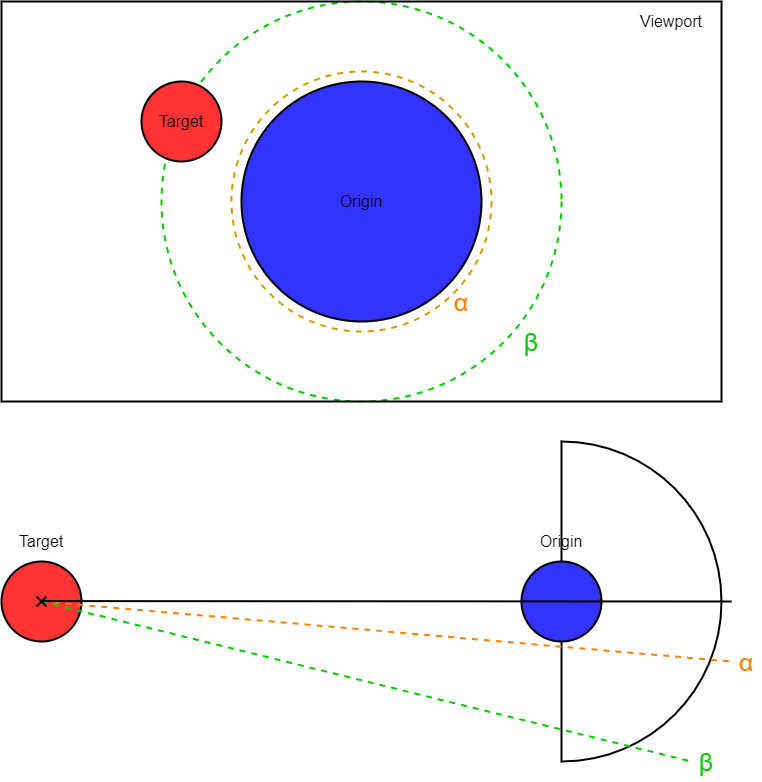

# Navigation Rules

## Surface to Surface
1. Determine Distance to target? check for significant curvature?  
  1.1. If Distance/Curvature >> x -> travel via Orbit  
  1.2. If Distance/Curvature < x -> travel via Parabola zoom
2. set look-at to point in Target's view direction
3. calculate parabola height based on distance between Target and Origin  
  3.1. adjust height based on [Collision Detection](#collision-detection-and-mitigation)
4. move along curve from Origin to Target, focusing on look-at

## Surface to Orbit
1. Determine, if [Target](#origintarget) (Target's frame center for anything but bookmarks in J2000 Frame, interplanetary bookmarks)
   is on same Hemisphere.  
  1.1. If Target is on same Hemisphere skip to [Step 2 of Orbit to Orbit](#orbit-to-orbit).  
  - not too far behind observer
2. Determine, if Observer [look-at] is above or below horizon.  
  2.1. If look-at is below horizon, lock onto surface point at look-at.  
  3.2. If look-at is above horizon, lock onto the nearest point on the horizon.  
  3.3. **Problem Case: If look-at is significantly above horizon (looking into the sky).**
    - move forward to orbit, then turn around?
    - pick a spot on the horizon anyways?
3. focusing on the look-at point, move the Observer back and up in a parabola curve towards orbit,
   until at [orbit travel distance](#orbit-travel-distance).

## Orbit to Surface
1. Determine, if a specific Target is given, and if the look-at is pointing at a point on the surface  
  1.1. If no Target is given, and the look-at is a point on the surface,
       set Target to that point with the Target look-at-vector pointing at the horizon based on the "up" direction of
       the orbit view.  
  1.2. If no Target is given, and the look at is not on the surface,
       set Target directly below / slightly in front of Observer (see step 3.1) with the look-at, at the nearest point
       on the surface from the current look-at-vector.  
  1.3. **Problem Case: If look-at is significantly (>90°) different from the vector towards target**
    - keep look-at, rotate so "down" is towards the Surface and descend?
    - define look-at on Target, pointing at the horizon towards north/"up" after rotation the Observer view to look
      at Target? 
2. Move in orbit above Target
3. Rotate Observer, so the Target's view vector is pointing "up"  
  3.1. Determine the angle of final loo-at and adjust the parabola,
       so the animation moves straight forward into final position  
  3.2. If Target's view > 90°, then move along surface and tilt up at the end of movement to avoid dipping below the 
       surface  
4. Move Observer along a parabola curve down to Target, decreasing the speed along the descent,
   while focusing on look-at.

## Orbit to Orbit

1. Move Observer along [Origin](#origintarget)'s orbit towards the nearest point where the following aspects are
   fulfilled:
  - the angle between the observer and the Target is between &alpha; and &beta;
    (so the Target is on screen and not omitted by Origin)
  - the dot product of the Observer-Target and Origin-Target vectors is positive
    (so the Observer is on the Target-far side of the Origin orbit)
2. Change focus (look-at) from Origin center to Target center
3. ([Do Collision detection and mitigation](#collision-detection-and-mitigation))
4. Move to Target Orbit

## Collision Detection and mitigation
### Orbit to Orbit collision

1. Check if travel path collides with any objects.
2. If collision detected, create new control point for curve at collision.
3. Check for collision object's center and move control point in opposite direction by the collision object's radius.
4. Adjust weight of control point based on travel distance or shortest distance of distance between Origin-Collision or
   Collision-Target.

### Surface to Surface collision
1. Sample elevation along line between Origin and Target
2. adjust parabola height or curve control points according to elevation profile  
  2.1. Alternative: check for intersection of elevation profile and parabola (2D), adjust parabola heigth to avoid
       intersection + safety margin

## Terms Glossary

### Origin/Target
- Origin or Target of the automatic movement.
- Separated into 2 categories/stages based on its counterpart (Target/Origin) and needed travel between them.
  1. a general destination (frame center name), leading to travel to orbit view of a planet.
  2. a specific destination (position & orientation in any frame), leading to travel to the specific position and
     orientation in orbit, on surface, or any bookmark in interplanetary space (relative to barycenter).

### Look-At
- point the observer is focusing on, keeping it in the center of the viewport.
- resulting in the vector the observer is oriented (looking direction)
  (also if no specific point is given).

### Orbit Travel Distance

- Orbit distance relative to object size so any object in Orbit-View has the same relative size.
  - e.g. current orbit distance to object after bookmark travel.

